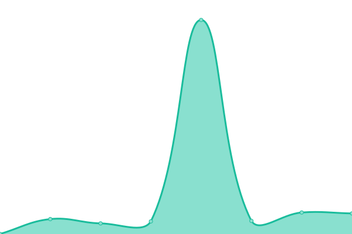

# [📈 Live Status](https://fabiuslabs.github.io/m4l-uptime): <!--live status--> **🟩 All systems operational**

This repository contains the open-source uptime monitor and status page for [Fabius Labs](fabiuslabs.com), powered by [Upptime](https://github.com/upptime/upptime).

With [Upptime](https://upptime.js.org), you can get your own unlimited and free uptime monitor and status page, powered entirely by a GitHub repository. We use [Issues](https://github.com/fabiuslabs/m4l-uptime/issues) as incident reports, [Actions](https://github.com/fabiuslabs/m4l-uptime/actions) as uptime monitors, and [Pages](https://fabiuslabs.github.io/m4l-uptime) for the status page.

<!--start: status pages-->
<!-- This summary is generated by Upptime (https://github.com/upptime/upptime) -->
<!-- Do not edit this manually, your changes will be overwritten -->
<!-- prettier-ignore -->
| URL | Status | History | Response Time | Uptime |
| --- | ------ | ------- | ------------- | ------ |
|  [M4L Portal](https://portal.momsforliberty.org/accounts/login/) | 🟩 Up | [m4-l-portal.yml](https://github.com/M4L-Repo/m4l-uptime/commits/HEAD/history/m4-l-portal.yml) | 

 782ms
     
 | 

<a href="https://M4L-Repo.github.io/m4l-uptime/history/m4-l-portal">100.00%</a>
    

|  [M4L WP](https://momsforliberty.org/donate-now/) | 🟩 Up | [m4-l-wp.yml](https://github.com/M4L-Repo/m4l-uptime/commits/HEAD/history/m4-l-wp.yml) | 

 2406ms
     
 | 

<a href="https://M4L-Repo.github.io/m4l-uptime/history/m4-l-wp">100.00%</a>
    

|  [M4L Staging](https://staging.momsforliberty.org) | 🟩 Up | [m4-l-staging.yml](https://github.com/M4L-Repo/m4l-uptime/commits/HEAD/history/m4-l-staging.yml) | 

 499ms
     
 | 

<a href="https://M4L-Repo.github.io/m4l-uptime/history/m4-l-staging">99.88%</a>
    

<!--end: status pages-->

[**Visit our status website →**](https://fabiuslabs.github.io/m4l-uptime)

## 📄 License

- Powered by: [Upptime](https://github.com/upptime/upptime)
- Code: [MIT](./LICENSE) © [Anand Chowdhary](https://anandchowdhary.com), supported by [Pabio](https://pabio.com)
- Data in the `./history` directory: [Open Database License](https://opendatacommons.org/licenses/odbl/1-0/)
